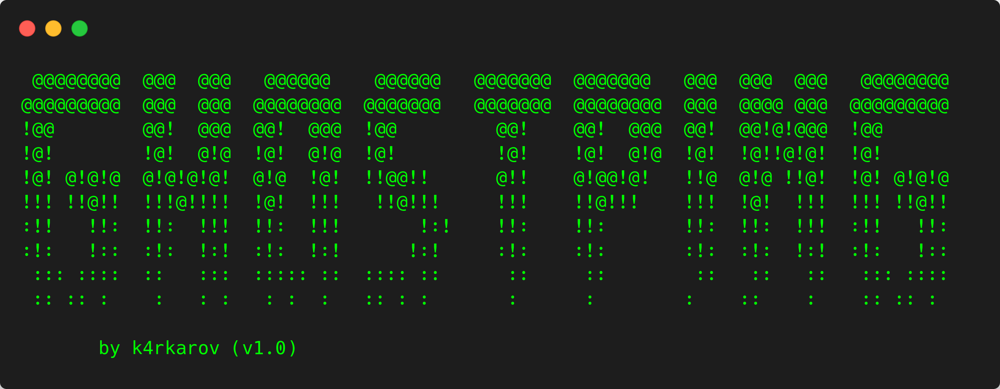

<h3 align="center">GhostPing</h3>
<h1 align="center"></h1>

A Go-based server that collects client device fingerprint and location data (latitude, longitude, IP), enriches it with geolocation details, and securely forwards it to a Telegram chat for real-time monitoring.

⚠️ **Disclaimer:** This project handles highly sensitive data (precise location, device details, IP info).  
Use it **only** in authorized contexts such as penetration testing, research, or your own personal projects.  
Do **not** deploy without user consent or outside the boundaries of applicable law.

---

# Installation

`ghostping` requires **Go 1.18** or later.

```sh
go install github.com/k4rkarov/ghostping@latest
````

After installation, the binary will be available in your `$GOPATH/bin` or `$HOME/go/bin`.
Make sure this directory is in your `PATH` so you can run `ghostping` directly.

---

# Usage

```sh
ghostping -h
```

This will display the help menu.

```console
                                                                                      
 @@@@@@@@  @@@  @@@   @@@@@@    @@@@@@   @@@@@@@  @@@@@@@   @@@  @@@  @@@   @@@@@@@@  
@@@@@@@@@  @@@  @@@  @@@@@@@@  @@@@@@@   @@@@@@@  @@@@@@@@  @@@  @@@@ @@@  @@@@@@@@@  
!@@        @@!  @@@  @@!  @@@  !@@         @@!    @@!  @@@  @@!  @@!@!@@@  !@@        
!@!        !@!  @!@  !@!  @!@  !@!         !@!    !@!  @!@  !@!  !@!!@!@!  !@!        
!@! @!@!@  @!@!@!@!  @!@  !@!  !!@@!!      @!!    @!@@!@!   !!@  @!@ !!@!  !@! @!@!@  
!!! !!@!!  !!!@!!!!  !@!  !!!   !!@!!!     !!!    !!@!!!    !!!  !@!  !!!  !!! !!@!!  
:!!   !!:  !!:  !!!  !!:  !!!       !:!    !!:    !!:       !!:  !!:  !!!  :!!   !!:  
:!:   !::  :!:  !:!  :!:  !:!      !:!     :!:    :!:       :!:  :!:  !:!  :!:   !::  
 ::: ::::  ::   :::  ::::: ::  :::: ::      ::     ::        ::   ::   ::   ::: ::::  
 :: :: :    :   : :   : :  :   :: : :       :      :        :    ::    :    :: :: :   
                                                                                      
       by k4rkarov (v1.0)

Usage:
  ghostping [options]

Options:
  -token TOKEN     Telegram bot token (required)
  -chat CHAT_ID    Telegram chat ID (required)
  -port PORT       Port to run the server (default: 8088)
  -h, --help       Show this help message

Description:
  GhostPing listens for POST requests on /send-location. 
  It extracts latitude and longitude from the JSON body, 
  resolves the client’s IP into city/country/ISP details, 
  then pushes a formatted message to your Telegram bot.
```

# Running GhostPing

```bash
ghostping -token 123456:ABCDEF -chat 987654321 -port 8088
Server running on port 8088...
```

By default:

* `GET /` serves static files from the `public/` directory (see below).
* `POST /send-location` accepts JSON with client data and pushes it to Telegram.

---

# `public/` directory

The server automatically serves everything inside a folder named `public/`.
This is where you place your client-side files (HTML/JS) that gather location and device details and send them back via `/send-location`.

Example structure:

```
ghostping/
  ├── public/
  │   └── index.html   # Your page requesting geolocation + fingerprint
  └── main.go
```

You can customize `public/index.html` to fit your use case.

---

# Telegram Setup

You need a **bot token** and a **chat ID**.

1. Open Telegram and start a chat with [@BotFather](https://t.me/BotFather).
2. Run `/newbot` and follow the instructions. Copy your bot token.
3. To get your chat ID:

   * Send a message to your bot.

   * Open in browser:

     ```
     https://api.telegram.org/bot<YOUR_BOT_TOKEN>/getUpdates
     ```

   * Look for `"chat":{"id":<YOUR_CHAT_ID>}` in the JSON response.

---

# Example Output

When a user visits your page and grants location access, GhostPing sends a message to Telegram:

```text
📍 Location
Latitude: -22.9129
Longitude: -43.2003

🌐 Network
IP: 203.0.113.10
City: Rio de Janeiro
Country: Brazil
ISP: Claro NXT Telecomunicacoes Ltda

🖥 Device
User-Agent: Mozilla/5.0 (Linux; Android 10; K) AppleWebKit/537.36 (KHTML, like Gecko) Chrome/139.0.0.0 Mobile Safari/537.36
Language: pt-BR
Timezone: America/Sao_Paulo
Screen: 412x915
DPR: 1.75
Platform: Linux armv81
Battery: 18% not charging
Connection: 4g, downlink: 10Mb/s, rtt: 150ms
CPU Cores: 8
Memory: 4.0 GB
Cookies Enabled: true
Plugins:
Touch Points: 2

🔗 [View on Google Maps](https://www.google.com/maps?q=-22.9129,-43.2003)
```

---

# Ngrok (optional)

If you want to expose GhostPing publicly (e.g., to test from a phone):

1. Install [ngrok](https://ngrok.com/download).
2. Authenticate:

   ```bash
   ngrok authtoken <YOUR_NGROK_AUTH_TOKEN>
   ```
3. Start a tunnel:

   ```bash
   ngrok http 8088
   ```
4. ngrok will provide a public URL like:

   ```
   https://abcd1234.ngrok-free.app/
   ```

   Share this URL. When opened in a browser, GhostPing will capture and forward the visitor’s data to Telegram.

---

# Notes

* Handles missing coordinates, unavailable IP data, and Telegram API errors gracefully.
* For production, consider running GhostPing as a `systemd` service or in a container.
* Contributions and issues are welcome via [GitHub](https://github.com/yourusername/ghostping).

---

Enjoy using GhostPing for **authorized** real-time location and device tracking.